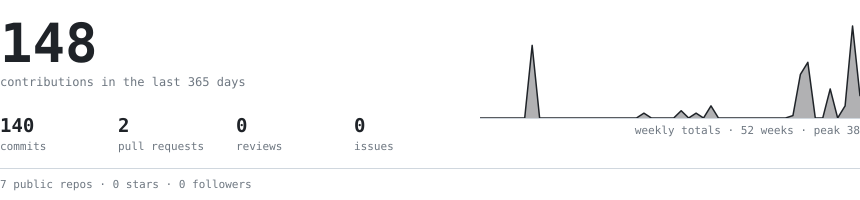
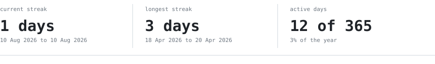
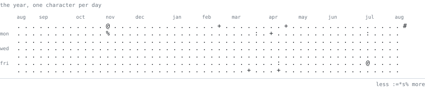
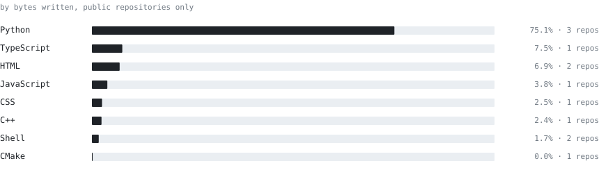

  <picture>
    <source media="(prefers-color-scheme: dark)" srcset="./portrait-dark.svg">
    
  </picture>

<picture>
  <source media="(prefers-color-scheme: dark)" srcset="./hd-whoami-dark.svg">
  
</picture>

> Everything on this page is drawn by this repository. No third-party widgets, 
> no image host that can rate-limit or go dark, nothing here that stops working 
> because somebody else's free tier ran out.

REWRITE ME. Two or three lines about what you actually work on, hard-wrapped at 
about 76 characters so the measure stays readable. Full-width paragraphs on 
GitHub run to roughly 110 characters, which is a genuinely bad line length.

<samp>python · typescript · c++ · html</samp>

<picture>
  <source media="(prefers-color-scheme: dark)" srcset="./hd-signal-dark.svg">
  
</picture>

<picture>
  <source media="(prefers-color-scheme: dark)" srcset="./stats-dark.svg">
  
</picture>

<picture>
  <source media="(prefers-color-scheme: dark)" srcset="./streak-dark.svg">
  
</picture>

<picture>
  <source media="(prefers-color-scheme: dark)" srcset="./year-dark.svg">
  
</picture>

<picture>
  <source media="(prefers-color-scheme: dark)" srcset="./hd-stack-dark.svg">
  
</picture>

<picture>
  <source media="(prefers-color-scheme: dark)" srcset="./langs-dark.svg">
  
</picture>

<picture>
  <source media="(prefers-color-scheme: dark)" srcset="./hd-contact-dark.svg">
  
</picture>

<samp>
  <a href="mailto:YOUR-EMAIL">email</a> ·
  <a href="https://YOUR-SITE">site</a> ·
  <a href="https://www.linkedin.com/in/YOUR-HANDLE">linkedin</a>
</samp>

  
<samp>how this page works</samp>

 

The portrait is one SVG. Each row of characters sits in a `clipPath` whose
rectangle animates from zero width to full, with a small block riding the wipe
edge as a cursor. Rows stagger top to bottom, and every animation is
`fill="freeze"`, so it prints once and stops.

The four graphics below it are redrawn every night by a scheduled action that
queries the GitHub GraphQL API and commits the result, but only when a number
actually changed. The generator uses nothing outside the Python standard
library.

Both carry their own font, base64-inlined, because an SVG loaded through an
`img` tag cannot fetch a subresource. Without that, the portrait grid would
shear on any machine whose default monospace is not exactly 0.600 em wide.

Code is in `scripts/`. Take any of it.

